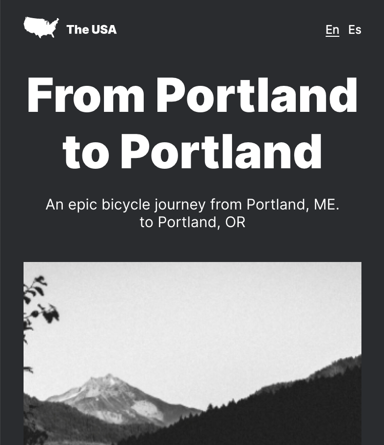

# Project 3: From Portland to Portland

## Intro

"Web Project" 3 is a project of the course with Practicum by Yandex (https://practicum.yandex.com/) to be a Web Developer.

## Description

The purpose of this project is to create a website fully responsive in all device sizes. 

Check out my work: https://santiag0sr.github.io/web_project_3/index.html

## Technologies and Techniques

We used CSS and HTML language to create the webpage and use diferent expresions like @media to make it responsive in a series of breakpoints.

We also organize the code so it is BEM compliant.
